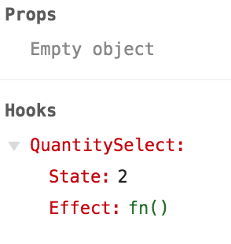

# Hooks!

---

# Hooks!

### _What are they good for?_

---

# Hooks!

### _What are they good for?_

## Absoloutely Everything!

---

## How we write components

```javascript
function QuantitySelector() {
  return (
    <div>
      <button onClick={() => null}>-</button>
      <input type="number" value={"1"} />
      <button onClick={() => null}>+</button>
    </div>
  );
}
```

---

❌ We would like our `QuantitySelector` component to ... work. _Unfortunately, function components don't provide access to state or lifecycle methods_.

---

### Class based component

```javascript
class QuantitySelector extends React.Component {
  constructor(props) {
    super(props);
    this.state = {
      quantity: 1
    };
  }

  render() {
    return (
      <div>
        <button onClick={() => null}>-</button>
        <input type="number" value={"1"} />
        <button onClick={() => null}>+</button>
      </div>
    );
  }
}
```

---

### Working class based component

[.code-highlight: all]

[.code-highlight: 4-9]

[.code-highlight: 12-22]

[.code-highlight: 27-29]

[.code-highlight: all]

```javascript
class QuantitySelector extends Component {
  constructor(props) {
    super(props);
    this.state = {
      quantity: 1
    };

    this.incrementQuantity = this.incrementQuantity.bind(this);
    this.decrementQuantity = this.decrementQuantity.bind(this);
  }

  incrementQuantity() {
    this.setState(state => ({
      quantity: state.quantity + 1
    }));
  }

  decrementQuantity() {
    this.setState(state => ({
      quantity: state.quantity - 1
    }));
  }

  render() {
    return (
      <div>
        <button onClick={this.decrementQuantity}>-</button>
        <input type="number" readOnly value={this.state.quantity} />
        <button onClick={this.incrementQuantity}>+</button>
      </div>
    );
  }
}
```

---

Classes Considered Harmful

[.autoscale: true]

[.build-lists: true]

- Harder to test and reason about. Function components are pure and easy to test
- Tie together behaviour and display. Not easily composable
- Related code does not live together; it's dispersed across `constrcutor`, `componentDidMount`, various handlers etc
- Won't benefit from future React optimizations for function components[^1]

[^1]: [https://reactjs.org/blog/2015/10/07/react-v0.14.html#stateless-function-components](https://reactjs.org/blog/2015/10/07/react-v0.14.html#stateless-function-components).

---

## Introducing the `useState` hook

---

[.code-highlight: 2,3]

```javascript
import React, { useState } from "react";
// in the top level scope of your function component:
const stateObjValue, setStateObjValue = useState(initialValue);
```

---

[.code-highlight: 3,4]

```javascript
import React, { useState } from "react";

const [stateObjValue, setStateObjValue] = useState(initialValue);
// curr value -⬆️
```

---

[.code-highlight: 3,4]

```javascript
import React, { useState } from "react";

const [stateObjValue, setStateObjValue] = useState(initialValue);
// function to update value ---⬆️
```

---

[.code-highlight: 3,4]

```javascript
import React, { useState } from "react";

const [stateObjValue, setStateObjValue] = useState(initialValue);
// React library function -----------------⬆️
```

---

[.code-highlight: 3,4]

```javascript
import React, { useState } from "react";

const [stateObjValue, setStateObjValue] = useState(initialValue);
// the initial value, can be anything ----------------⬆️
```

---

ℹ️ `useState` allows us to use local state in a function component

---

Apply `useState` to our class based component

[.code-highlight: all]

[.code-highlight: 1,4]

[.code-highlight: 6, 7, 11, 12, 13]

[.code-highlight: all]

```javascript
import React, { useState } from "react";

function QuantitySelector() {
  const [quantity, setQuantity] = useState(1);

  const incrementQuantity = () => setQuantity(quantity + 1);
  const decrementQuantity = () => setQuantity(quantity - 1);

  return (
    <div>
      <button onClick={() => decrementQuantity()}>-</button>
      <input type="number" readOnly value={quantity} />
      <button onClick={() => incrementQuantity()}>+</button>
    </div>
  );
}
```

---

❓ What about lifecycle methods (`componentDidMount`)

---

Let us add a feature in our component to update cart (a side effect) whenever the quantity is updated

---

Back to a class based approach

[.code-highlight: all]

[.code-highlight: 6-12]

```javascript
class QuantitySelector extends Component {
  constructor(props) {
    // …
  }

  componentDidMount() {
    CartAPI.setQuantity(this.state.quantity);
  }

  componentDidUpdate() {
    CartAPI.setQuantity(this.state.quantity);
  }

  incrementQuantity() {
    // …
  }

  decrementQuantity() {
    // …
  }

  render() {
    // …
  }
}
```

---

💔 We need to get away from classes

---

## Introducing the `useEffect` hook

---

[.code-highlight: 3-7]

```javascript
import React, { useEffect } from "react";

// in the top level scope of your function component:
useEffect(() => {
  // imperative, effectful code.
  // will fire on mount and after every update
};
```

---

[.code-highlight: 5-7]

```javascript
import React, { useEffect } from "react";

// in the top level scope of your function component:
useEffect(() => {
  // will only fire when `foo` or `bar` change
}, [foo, bar]);
```

---

[.code-highlight: 5-7]

```javascript
import React, { useEffect } from "react";

// in the top level scope of your function component:
useEffect(() => {
  // will only fire on component mount
}, []);
```

---

Apply `useEffect` to our class based component

[.code-highlight: all]

[.code-highlight: 4-6]

```javascript
function QuantitySelector() {
  const [quantity, setQuantity] = useState(1);

  useEffect(() => {
    CartAPI.setQuantity(quantity);
  }, [quantity]);

  const incrementQuantity = () => setQuantity(quantity + 1);
  const decrementQuantity = () => setQuantity(quantity - 1);

  return (
    <div>
      <button onClick={() => decrementQuantity()}>-</button>
      <input type="number" readOnly value={quantity} />
      <button onClick={() => incrementQuantity()}>+</button>
    </div>
  );
}
```

---

📵 Time to get freaky

---

Let's consolidate our behaviour into a custom hook!

[.code-highlight: all]

[.code-highlight: 2]

[.code-highlight: 4-6]

[.code-highlight: 11]

[.code-highlight: all]

```javascript
function useQuantitySelect(initialQuantity) {
  const [quantity, setQuantity] = useState(initialQuantity);

  useEffect(() => {
    CartAPI.setQuantity(quantity);
  }, [quantity]);

  const incrementQuantity = () => setQuantity(quantity + 1);
  const decrementQuantity = () => setQuantity(quantity - 1);

  return { quantity, setQuantity, incrementQuantity, decrementQuantity };
}
```

---

Using a custom hook

[.code-highlight: all]

[.code-highlight: 2-4]

[.code-highlight: all]

```javascript
function QuantitySelector() {
  const { quantity, incrementQuantity, decrementQuantity } = useQuantitySelect(
    1
  );

  return (
    <div>
      <button onClick={() => decrementQuantity()}>-</button>
      <input type="number" readOnly value={quantity} />
      <button onClick={() => incrementQuantity()}>+</button>
    </div>
  );
}
```

---

## Other hooks

---

## `useContext`

Returns the current value of the context.

```javascript
const value = useContext(MyContext);
```

---

## `useReducer`

A useful replacement for `getState` when the state object is complex or the logic for updating it is complex.

```javascript
const [state, dispatch] = useReducer(reducer, initialArg, init);

// get values from the state
const hasDiscont = state.price.hasDiscount;

// dispatch actions
dispatch({ type: "QUANTITY/INCR", payload: 1 });
```

---

## `useMemo`

Returns a memoized value. For performance optimization - think `shouldComponentUpdate`:

```javascript
const memoizedValue = useMemo(() => computeExpensiveValue(a, b), [a, b]);
```

---

## `useCallback`

Returns a memoized callback. For performance optimization - think `shouldComponentUpdate`:

```javascript
const memoizedCallback = useCallback(() => {
  doSomething(a, b);
}, [a, b]);
```

---

## `useRef`

Allows you to mutate the passed in ref object.

Useful for DOM manipulation, but it can also be used for working with any type of mutable value.

```javascript
const refContainer = useRef(initialValue);
```

---

💖 And many more!

---

[.autoscale: true]

[.build-lists: true]

Benefits of hooks:

- static typing better than higher order components
- keep related code together (eg, `componentDidMount` and `componentWillUnmount`)
- resue behaviour and state management
- don't need deep nesting in the component tree - less work for React to do
- no overhead of creating classes and even handler binding
- good devtools support
  - 

---

❔ So, what's the lowdown?

---

# Hooks!

---

# Hooks!

### _What are they good for?_

---

# Hooks!

### _What are they good for?_

## Absoloutely Everything!

---

[.autoscale: true]

**Code from deck**

- [Repl.it project](https://repl.it/@talhasyed/hooks)

**Official docs**

- [React Hooks](https://reactjs.org/docs/hooks-intro.html)
- [Hooks API Reference](https://reactjs.org/docs/hooks-reference.html)
- [Hooks Rules](https://reactjs.org/docs/hooks-rules.html)

**Other links**

- [Functional vs Class-Components in React](https://medium.com/@Zwenza/* functional-vs-class-components-in-react-231e3fbd7108)
- [Rangle | Refactor to React Hooks, Not Classes](https://rangle.io/blog/* refactor-to-react-hooks-not-classes/)
- [Rangle | Simplifying React Forms with Hooks](https://rangle.io/blog/* simplifying-controlled-inputs-with-hooks/)
- [State Management with React Hooks — No Redux or Context API](https://medium.com/* javascript-in-plain-english/state-management-with-react-hooks-no-redux-or-context-api-8b3035ceecf8)
- [How to fetch data with React Hooks?](https://www.robinwieruch.de/react-hooks-fetch-data/)
